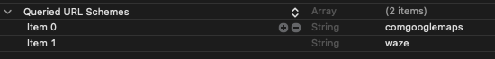
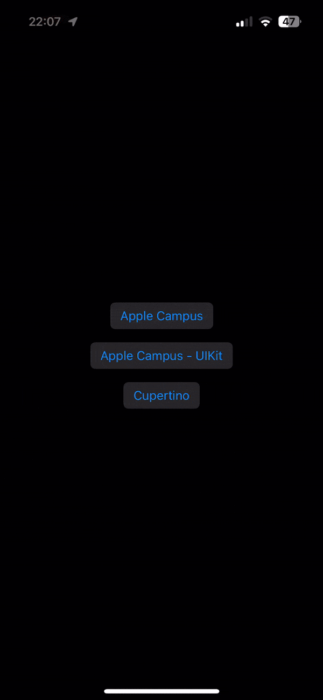

# ThirdPartyMapper

_Interact with third-party iOS map clients, using custom URL schemes or helper methods allowing your user to pick their preferred map client._


[](https://github.com/lordzsolt/ThirdPartyMapper/raw/master/LICENSE)

## Example


## Supported map clients

Client             | URL Scheme      | App Store
------------------ | --------------- | ---------
Apple Maps         | `maps`          | [link](https://apps.apple.com/app/id915056765)
Google Maps        | `comgooglemaps` | [link](https://apps.apple.com/app/id585027354)
Waze               | `waze`          | [link](https://apps.apple.com/app/id323229106)
More to come...    |                 | 

Unfortunately, not all map clients offer URL schemes to be supported by `ThirdPartyMapper`. If you’re aware of another candidate, please [let us know](https://github.com/lordzsolt/ThirdPartyMapper/issues).


## How to install

### Swift Package Manager

In Xcode, click on the “File” menu, “Swift Packages”, “Add Package Dependency…”, then enter the URL for this repo: 

```
https://github.com/lordzsolt/ThirdPartyMapper.git
```

### CocoaPods

With [CocoaPods](https://cocoapods.org), simply add ThirdPartyMapper to your Podfile:

```
pod 'ThirdPartyMapper'
```

Or, you can manually import the files from the Sources folder.


## How to use

### IMPORTANT:

In order for ThirdPartyMapper to work, you need to declare URL Schemes of the Apps you would like to use in the `Info.plist` file of your project:

```
    <key>LSApplicationQueriesSchemes</key>
    <array>
        <string>comgooglemaps</string>
        <string>waze</string>
    </array>
```




### `isExactLocation` flag

You will notice that most methods have a parameter `isExactLocation`. This is to specify if the `searchQuery` should be used to navigate the user to an exact location, such as an address.

**In case you want to highlight a general area on a map, such as California, pass `false` to this argument. This feature is not supported by all apps.**



### Getting the list of supported clients

```swift
let clients = ThirdPartyMapper.allowedClients
```

### Reordering or changing the list of clients

Sometimes depending on which geogrephical region you are making your app available, you could decide to show the list of clients in a different order, or show a specific list of your choice. This is why `ThirdPartyMapper.allowedClients` is publically settable.

```swift
ThirdPartyMapper.allowedClients = [.waze, .googleMaps]
```

### Retrieving a list of installed clients

```swift
let installedClients = ThirdPartyMapper.installedClients(
    searchQuery: "One Apple Park Way, Cupertino, CA 95014, United States",
    isExactLocation: true)
```

### Show client picker action sheet in UIKit

```swift
ThirdPartyMapper.openClientPicker(
    searchQuery: "One Apple Park Way, Cupertino, CA 95014, United States",
    isExactLocation: true,
    on: viewController)
```

### Show client picker confirmation dialog in SwiftUI (iOS 15.0)

```swift
struct ContentView: View {
    private static let appleCampusAddress = "One Apple Park Way, Cupertino, CA 95014, United States"
    @State var isMapPickerShown = false

    var body: some View {
        VStack {
            Button("Apple Campus") {
                isMapPickerShown = true
            }
            .buttonStyle(.bordered)
            .frame(height: 40)
        }
        .mapPicker(
            searchQuery: Self.appleCampusAddress,
            isExactLocation: true,
            isPresented: $isConfirmationDialogShown)
    }
}
```

### Show client picker action sheet in SwiftUI (pre-iOS 15.0)

```swift
struct ContentView: View {
    private static let appleCampusAddress = "One Apple Park Way, Cupertino, CA 95014, United States"
    @State var isMapPickerShown = false

    var body: some View {
        VStack {
            Button("Apple Campus") {
                isMapPickerShown = true
            }
            .buttonStyle(.bordered)
            .frame(height: 40)
        }
        .mapPickerActionSheet(
            searchQuery: Self.appleCampusAddress,
            isExactLocation: true,
            isPresented: $isConfirmationDialogShown)
    }
}
```

## Requirements

ThirdPartyMapper is written in Swift 5.0, requires iOS 11.0 and above, Xcode 10.2 and above.


## Credits

ThirdPartyMapper was created by [Zsolt Kovacs](https://iosmith.com/).

The project takes inspiration from [ThirdPartyMailer](https://github.com/vtourraine/ThirdPartyMailer).


## License

ThirdPartyMapper is available under the MIT license. See the [LICENSE](./LICENSE) file for more info.
